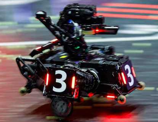

# AT INFANTRY

=======

RoboMaster Infantry Based On Stm32H7

## 简介

适配队内串联腿步兵机器人

### Development

持续开发中

## 一些待完善的工作

- [x] 完成LQR算法
- [x] 完成VMC算法
- [x] 实现底盘电机控制
- [ ] 实现底盘平衡
- [ ] 实现跳跃
- [ ] 实现倒地自救
- [ ] 实现自动跳跃
- [ ] 力矩规划